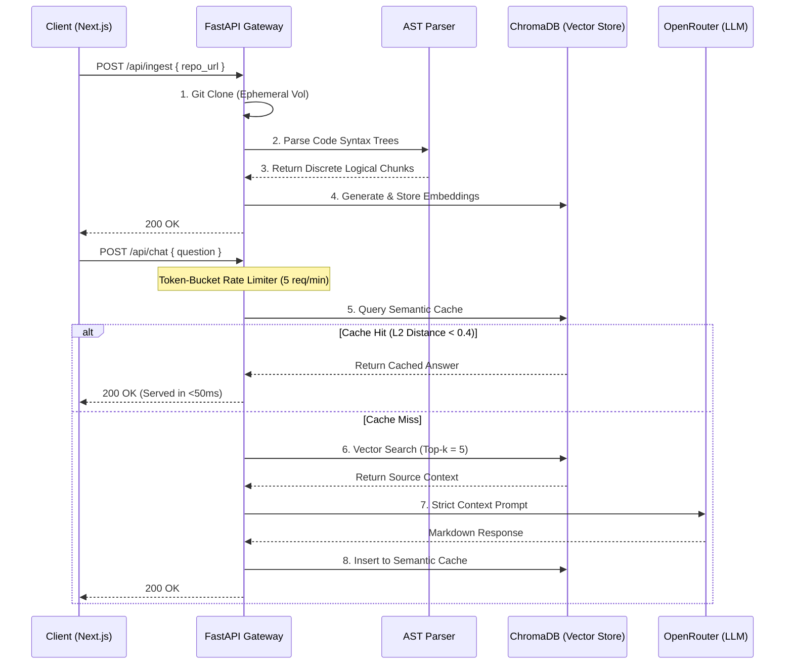

# 🧠 AI Codebase Onboarding Agent

   

An end-to-end Retrieval-Augmented Generation (RAG) system designed to instantly vectorize undocumented repositories and provide an interactive, LLM-powered architectural chat interface.

---

## 📖 High-Level Overview
This system accelerates developer onboarding. It clones a target Git repository, parses the raw code into intelligent mathematical vectors, and allows developers to query the architecture in real-time. Instead of manually traversing thousands of lines of code, developers receive immediate, code-backed answers generated by advanced LLMs (LLaMA 3 / GPT-4).

---

## 🏗️ System Architecture & Data Flow



---

## 🔬 System Design & Engineering Trade-offs
*This section details the architectural decisions made to ensure scalability, cost-efficiency, and accuracy.*

### 1. AST Parsing vs. Naive Chunking
* **The Problem:** Standard RAG pipelines use naive overlapping character splitters (e.g., splitting every 1,000 tokens). In software engineering, this is catastrophic. Splitting a `for-loop` or a `class` definition in half destroys the semantic meaning of the code for the LLM.
* **The Solution:** The ingestion engine uses Python's `ast` (Abstract Syntax Tree) module. It structurally analyzes the code and extracts exact discrete nodes (`FunctionDef`, `ClassDef`). 
* **Trade-off:** AST parsing is computationally heavier and language-specific (currently optimized for Python). If the parser encounters a Syntax Error or an unsupported language, the system safely falls back to a sliding-window overlap chunker.

### 2. Semantic Caching (Cost & Latency Optimization)
* **The Problem:** LLM generation takes 3-10 seconds and consumes expensive tokens. Duplicate or highly similar queries ("How does auth work?" vs "Explain the authentication flow") shouldn't incur this cost twice.
* **The Solution:** Implemented a secondary `semantic_cache` vector collection. Incoming questions are embedded and mathematically compared against past queries. If the L2 (Euclidean) distance is `< 0.4` (indicating high semantic similarity), the system bypasses the LLM entirely.
* **Trade-off:** Cache invalidation is complex. The cache must be explicitly purged whenever a new repository is ingested to prevent serving stale answers from previous codebases.

### 3. Rate Limiting & API Security
* **The Problem:** Public-facing LLM endpoints are highly susceptible to abuse and DDoS token-draining attacks.
* **The Solution:** The FastAPI gateway implements an IP-based Token-Bucket rate limiting algorithm via `slowapi`, restricting clients to 5 queries per minute.

### 4. UI/UX: Unblocking the Main Thread
* **The Design:** The frontend utilizes a React Three Fiber WebGL canvas. Because 3D rendering happens on the GPU via `requestAnimationFrame`, passing API loading states (`isThinking`) to the 3D physics engine (`THREE.MathUtils.lerp`) provides smooth, premium visual feedback completely independently of React's Virtual DOM blocking cycles.

---

## 🎯 Interview Q&A (For Reviewers)

**Q: Why use local ChromaDB instead of a managed cloud vector database like Pinecone?**
> **A:** For this specific MVP scope, a local persistent ChromaDB eliminates network latency during the high-volume ingestion phase (inserting thousands of chunks at once) and keeps infrastructure dependencies low. However, the `vector_service.py` is written using the Repository Pattern. The underlying DB can be swapped to Pinecone or pgvector without altering the FastAPI route controllers if horizontal scaling across multiple stateless containers is required.

**Q: How would you scale this system to handle 10,000 massive repositories?**
> **A:** The current `/api/ingest` endpoint is synchronous, which would result in HTTP timeouts for massive repos (like the Linux Kernel). To scale, I would decouple ingestion. The API would return a `202 Accepted` with a `task_id`. A distributed message queue (Redis + Celery) would handle the Git cloning, AST chunking, and embedding asynchronously across a pool of worker nodes, notifying the client via WebSockets when complete.

**Q: What prevents the LLM from hallucinating code that doesn't exist?**
> **A:** The prompt engineering is strictly grounded. The LLM is configured with a low temperature (`0.1`) and explicitly instructed to *only* reference the code chunks provided in the context window. Furthermore, the backend extracts the `file_path` metadata from the vector search and forces the LLM to cite its sources in the UI, ensuring traceability.

---

## 💻 Local Development Setup

```bash
# 1. Clone the repository
git clone https://github.com/yourusername/onboarding-agent.git

# 2. Start the Backend (FastAPI)
cd backend
python -m venv venv
source venv/bin/activate
pip install -r requirements.txt

# Create backend/.env
echo "OPENROUTER_API_KEY=your_key_here" > .env
echo "FRONTEND_URL=http://localhost:3000" >> .env

uvicorn app.main:app --reload

# 3. Start the Frontend (Next.js)
# Open a new terminal
cd frontend
npm install
npm run dev
```