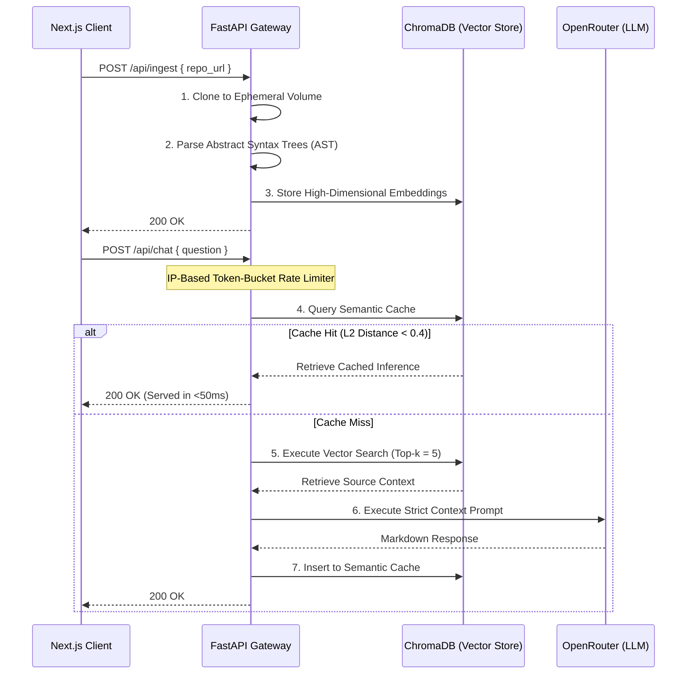

# Onboarding Agent

   

An enterprise-grade Retrieval-Augmented Generation (RAG) system designed to accelerate software engineer onboarding. The agent autonomously ingests undocumented repositories, mathematically vectorizes the source code, and provides a low-latency, conversational interface for architectural queries.

---

## Overview

Developer onboarding in large-scale, undocumented systems is traditionally a high-friction process requiring days of manual code traversal. This system mitigates that friction by acting as an autonomous technical lead. 

1. **Ingestion & Parsing:** The system clones target repositories and parses the code structurally rather than relying on naive string chunking.
2. **Vectorization:** The discrete code blocks are embedded into a high-dimensional vector space.
3. **Retrieval & Inference:** When queried, the system performs a mathematical similarity search to retrieve the exact context required, passing it to a Large Language Model (LLaMA 3 / GPT-4) to generate highly accurate, code-backed architectural explanations.

---

## System Architecture

The application is a fully decoupled monorepo built on modern distributed system principles.



---

## Key Engineering Decisions

To ensure production readiness, scalability, and cost-efficiency, the following architectural patterns were implemented:

### 1. Abstract Syntax Tree (AST) Parsing
Standard RAG pipelines utilize overlapping character splitters (e.g., splitting every 1,000 tokens), which frequently bisect function or class definitions, destroying semantic meaning. This ingestion engine utilizes Python's native `ast` module to structurally parse code, ensuring that discrete logical blocks (functions, classes) are embedded perfectly intact. 

### 2. Semantic Caching Layer
LLM inferences incur significant latency (3–10 seconds) and financial cost. To optimize this, the system implements a secondary `semantic_cache` vector collection. Incoming queries are embedded and compared against historical requests. If the L2 (Euclidean) distance is `< 0.4` (indicating a highly similar semantic intent), the system bypasses the LLM entirely and serves the cached response instantly.

### 3. Rate Limiting & API Security
Public-facing LLM endpoints are highly susceptible to DDoS and token-draining abuse. The FastAPI gateway is protected by an IP-based Token-Bucket rate limiting algorithm via `slowapi`, restricting clients to a strict quota of queries per minute.

### 4. Non-Blocking Client Rendering
The frontend utilizes a React Three Fiber WebGL canvas. By passing network loading states (`isThinking`) directly to the 3D physics engine (`THREE.MathUtils.lerp`), the application provides smooth, premium visual feedback independently of React's Virtual DOM rendering cycle, ensuring zero main-thread blocking during heavy data fetches.

---

## Local Development & Setup

### Prerequisites
* Node.js (v20+)
* Python (3.10+)
* An [OpenRouter API Key](https://openrouter.ai/)

### Backend Setup (FastAPI)
```bash
# Navigate to the backend directory
cd backend

# Initialize and activate the virtual environment
python -m venv venv
source venv/bin/activate  # Windows: venv\Scripts\activate

# Install dependencies
pip install -r requirements.txt

# Configure environment variables
echo "OPENROUTER_API_KEY=your_api_key_here" > .env
echo "FRONTEND_URL=http://localhost:3000" >> .env

# Start the ASGI server
uvicorn app.main:app --reload
```

### Frontend Setup (Next.js)
```bash
# Open a new terminal session
cd frontend

# Install dependencies
npm install

# Start the development server
npm run dev
```

Navigate to `http://localhost:3000` to access the interface.