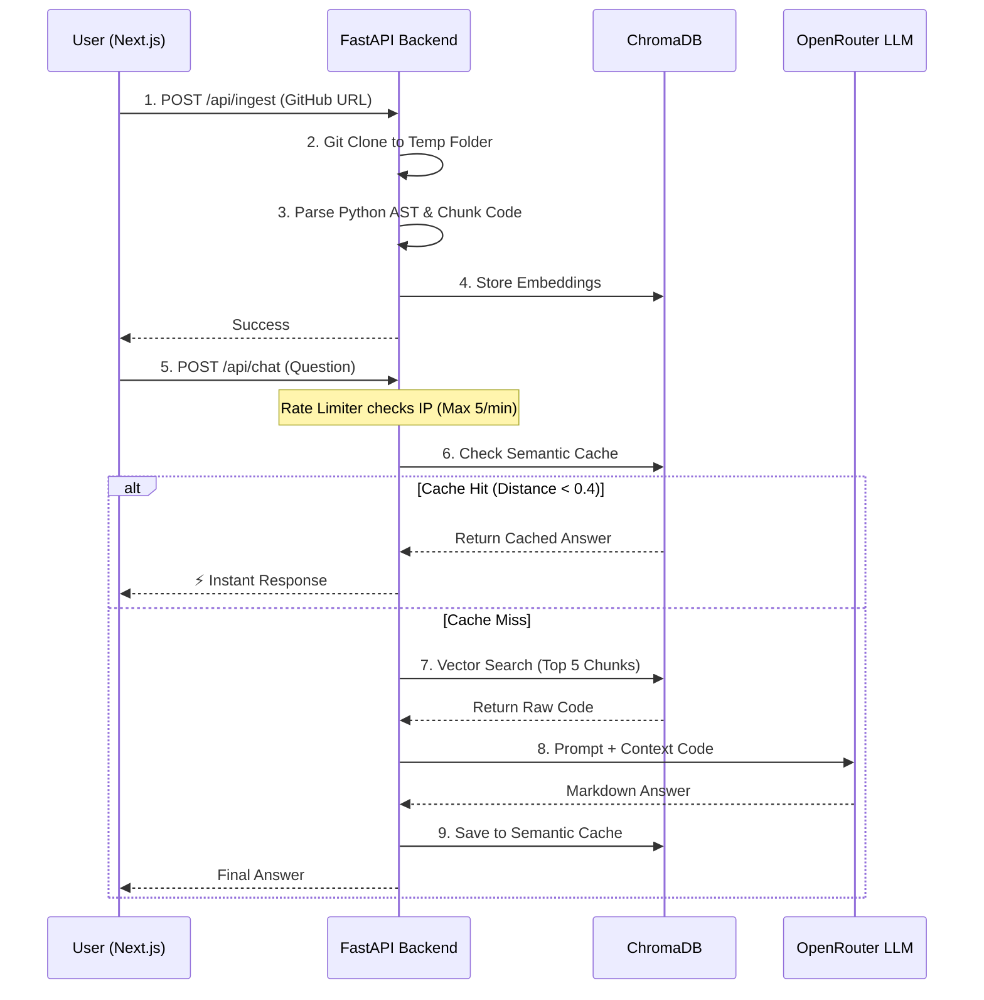

# 🧠 AI Codebase Onboarding Agent

   

Welcome to the **AI Codebase Onboarding Agent**! This project is designed to help software engineers instantly understand massive, undocumented codebases. 

You simply paste a GitHub URL into the UI, and the system downloads the code, reads it, mathematically vectorizes it, and allows you to chat with an AI about the architecture in real-time.

---

## 📖 How to Understand This Project (The Simple Explanation)
Imagine you are handed a 10,000-line codebase and told to "fix a bug." Usually, you would spend days reading files just to understand how things connect.

This agent acts as a Senior Engineer who has already read the code. 
1. **Ingestion:** It downloads the repository and chops the code into smaller, readable pieces.
2. **Vectorization:** It converts those pieces into mathematical coordinates (vectors) and stores them in a database.
3. **Retrieval (RAG):** When you ask, *"How does the auth work?"*, it mathematically searches the database for the 5 most relevant pieces of code, hands them to an LLM (like LLaMA 3 or GPT-4), and gives you a highly accurate, code-backed answer.

This pattern is called **Retrieval-Augmented Generation (RAG)**.

---

## 🏗️ System Architecture (The Technical Explanation)

This system is a fully decoupled Monorepo (Frontend + Backend) built with production-grade engineering principles.



### 🖥️ The Frontend (Next.js App Router)
The user interface is built for a premium, developer-first experience.
* **Framework:** Next.js 16 with React 19.
* **Styling:** Tailwind CSS v4 with a custom pitch-black typography theme.
* **3D Rendering:** Uses **React Three Fiber** and WebGL to render an interactive 3D particle swarm. The physics engine smoothly accelerates the particles when the backend API is actively fetching data, providing visual loading feedback without traditional spinners.
* **Markdown:** Responses are parsed via `react-markdown` and `remark-gfm` to perfectly render AI-generated tables, lists, and syntax-highlighted code blocks.

### ⚙️ The Backend (Python FastAPI)
The backend is a high-performance REST API handling the heavy lifting of the RAG pipeline.
* **Framework:** FastAPI (Asynchronous Python).
* **Intelligent AST Chunking:** Instead of naively splitting code every 1,000 characters (which might cut a function in half), the backend uses Python's `ast` (Abstract Syntax Tree) module to parse the code structurally. Entire functions and classes are kept perfectly intact as single chunks.
* **Database:** ChromaDB (Persistent Vector Store).

---

## 🚀 SDE1+ Engineering Highlights
This project includes several mid-level engineering patterns designed for production readiness:

1. **Semantic Caching:** LLM calls are expensive and slow. This system utilizes a dedicated `semantic_cache` ChromaDB collection. When a user asks a question, the API embeds the question and calculates the mathematical distance against past questions. If a highly similar intent is detected (Distance `< 0.4`), it bypasses the LLM entirely and serves the cached answer instantly.
2. **Rate Limiting:** Endpoints are protected by `slowapi` (Token-Bucket algorithm). The chat endpoint strictly limits requests (e.g., 5 per minute per IP) to prevent malicious actors from draining API credits.
3. **Graceful Error Boundaries:** The frontend utilizes `try/catch` and UI fallback states to gracefully render API timeouts or backend crashes without breaking the React tree.

---

## 💻 How to Run Locally

### Prerequisites
* Node.js (v20+)
* Python (3.10+)
* An [OpenRouter API Key](https://openrouter.ai/) (Free)

### 1. Start the Backend
```bash
cd backend
python -m venv venv
source venv/bin/activate  # On Windows use: venv\Scripts\activate
pip install -r requirements.txt
```
Create a `.env` file in the `backend` folder:
```env
OPENROUTER_API_KEY=your_api_key_here
OPENROUTER_MODEL=openrouter/auto
FRONTEND_URL=http://localhost:3000
```
Run the server:
```bash
uvicorn app.main:app --reload
```

### 2. Start the Frontend
Open a new terminal.
```bash
cd frontend
npm install
npm run dev
```

Visit `http://localhost:3000` in your browser. Paste a public GitHub URL and start chatting!